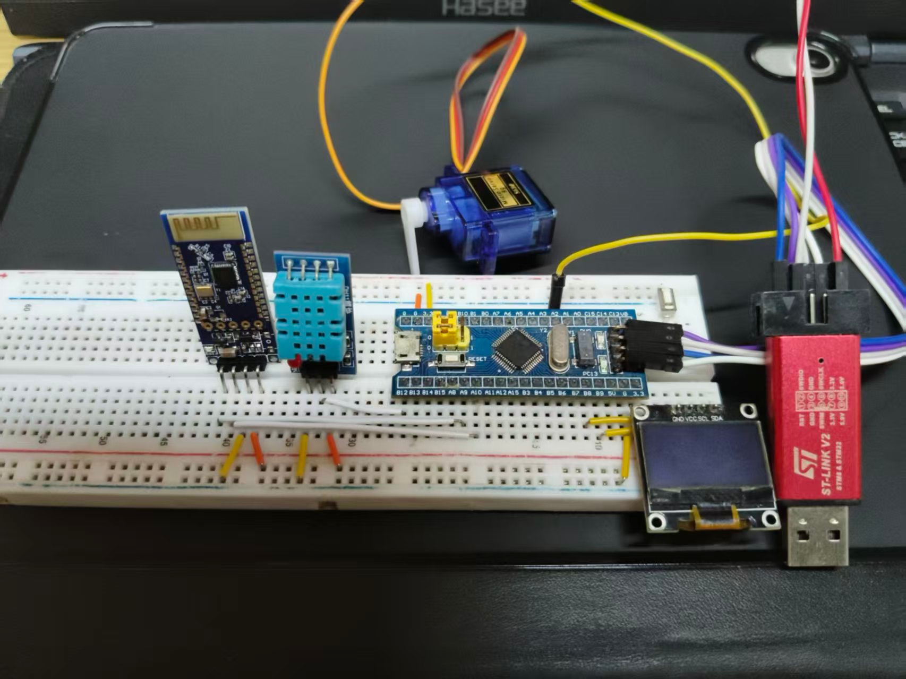
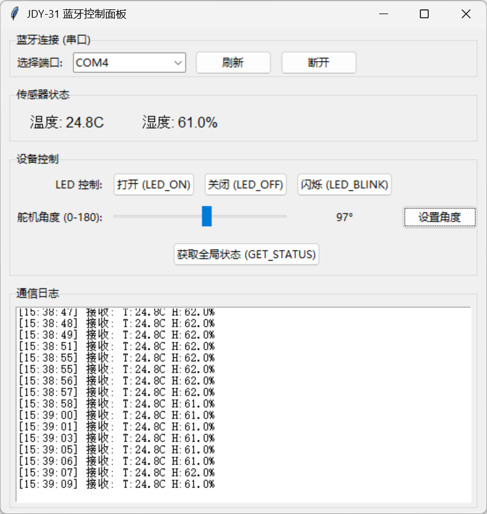
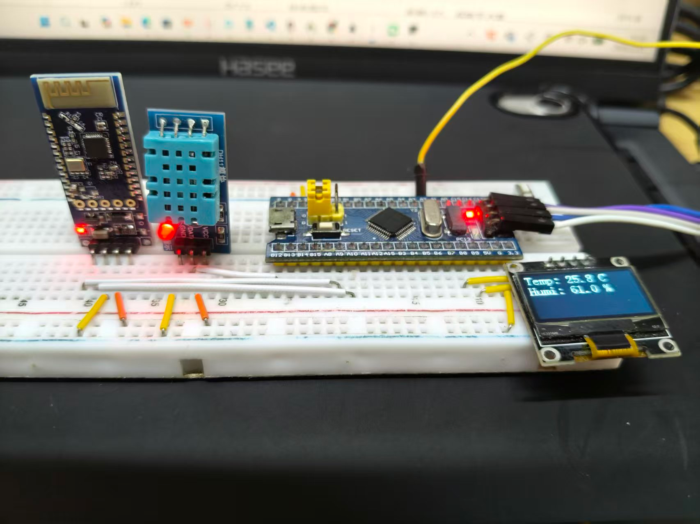
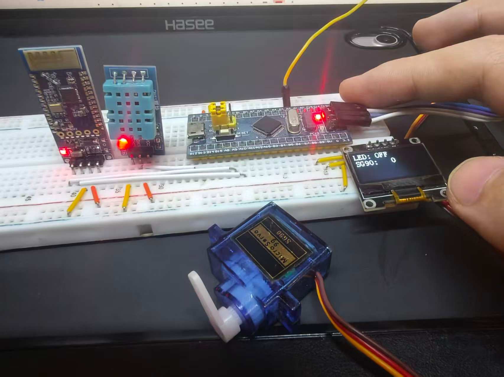
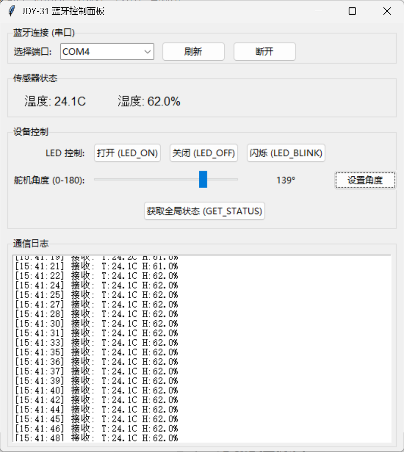
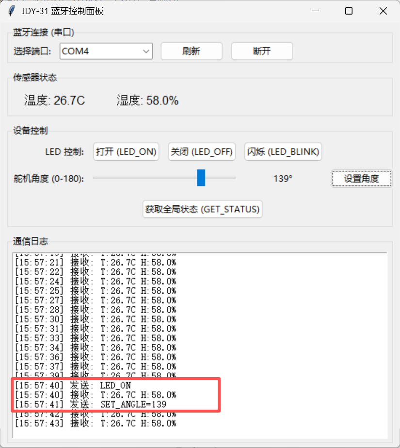
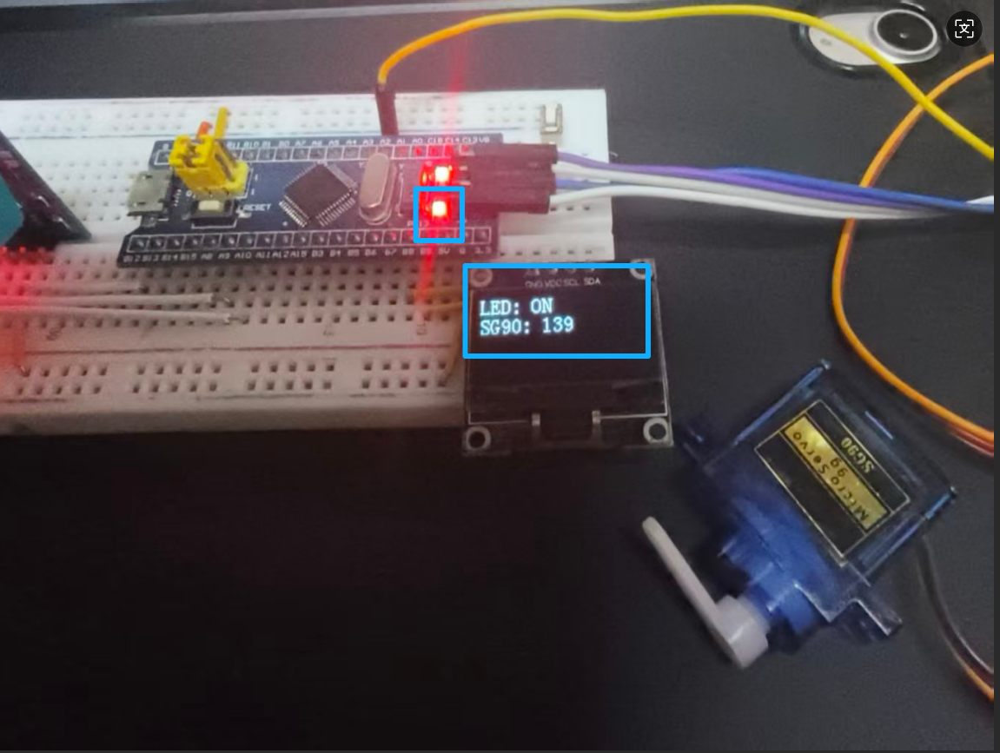
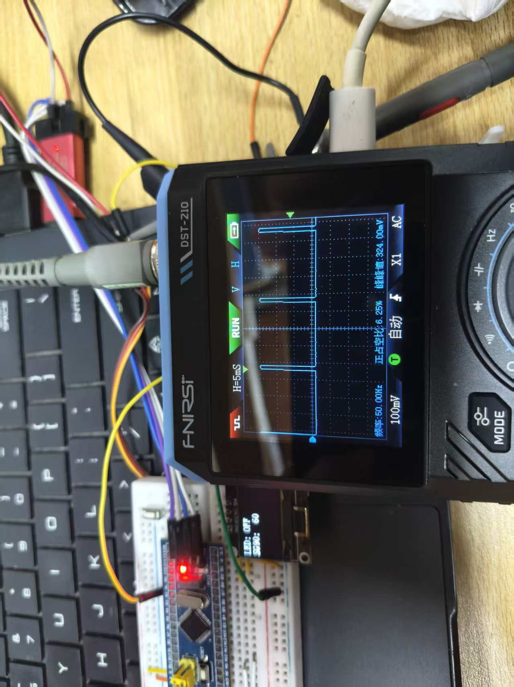

# 基于STM32+freeRTOS的温湿度监视与远程控制统

基于 STM32F103C8T6 和 FreeRTOS 的智能设备控制系统，支持蓝牙通信、温湿度采集、舵机控制和OLED显示等功能。

## 项目简介

本项目是一个基于 FreeRTOS 实时操作系统的嵌入式智能设备控制系统，通过 JDY31 蓝牙模块实现与手机APP的通信，集成多种传感器和外设，实现远程控制和数据监控功能。

## 硬件平台

- **微控制器**: STM32F103C8T6 (Cortex-M3, 72MHz)
- **开发环境**: STM32CubeMX + Keil MDK-ARM V5.32
- **RTOS**: FreeRTOS
- **Firmware**: STM32Cube FW_F1 V1.8.7

## 硬件配置

### 外设引脚分配

| 外设 | 引脚 | 功能 | 说明 |
|------|------|------|------|
| LED | PC13 | 状态指示 | 板载LED，低电平点亮 |
| 按键 | PA0 | 外部中断 | 消抖触发，切换OLED显示页面 |
| DHT11 | PB12 | 温湿度传感器 | 单总线通信 |
| OLED_SCL | PB8 | I2C时钟线 | OLED显示屏 |
| OLED_SDA | PB9 | I2C数据线 | OLED显示屏 |
| SG90 | PA2 | PWM输出 | TIM2_CH3，舵机控制 |
| JDY31_TX | PA9 | UART发送 | 蓝牙模块 |
| JDY31_RX | PA10 | UART接收 | 蓝牙模块 |

### 物料：



| 物料名称     | 具体型号 / 规格                                  | 数量 | 核心作用                               | 项目适配要点                                                 |
| ------------ | ------------------------------------------------ | ---- | -------------------------------------- | ------------------------------------------------------------ |
| 主控板       | STM32F103C8T6 最小系统板（带 USB 下载 / 供电）   | 1    | 系统核心，运行 FreeRTOS + 所有业务逻辑 | 适配文档 20KB SRAM、72MHz 系统时钟，带 GPIO/USART/TIM 外设，省去裸片焊接麻烦 |
| 温湿度传感器 | DHT11 模块（带杜邦线，板载上拉电阻）             | 1    | 周期采集环境温湿度数据                 | 单总线 GPIO 连接，适配文档 PB12 引脚，模块款无需额外接电阻，稳定性更高 |
| 蓝牙模块     | JDY-31 蓝牙透传模块（带底板 + 杜邦线）           | 1    | 与手机 APP 双向无线通信                | USART1 接口，适配文档 PA9 (TX)/PA10 (RX) 引脚，透传模式无需复杂配置，直接对接项目协议 |
| 舵机         | SG90 9g 舵机（含杜邦线）                         | 1    | 执行 0-180° 指定角度旋转控制           | PWM 输出，适配文档 TIM2_CH3 (PA2) 引脚，5V 供电，扭矩满足课设需求 |
| OLED 显示屏  | 0.96 寸 I2C 接口 OLED（4 针款：VCC/GND/SCL/SDA） | 1    | 双画面显示温湿度、设备状态             | 软件 I2C，适配文档 PB8 (SCL)/PB9 (SDA) 引脚，4 针款接线简单，无花屏风险 |
| 独立按键     | 轻触按键（6*6*5mm 常用款）                       | 1    | OLED 屏双画面切换控制                  | 外部中断触发，适配文档 PA0 (EXTI0) 引脚，轻触款手感好，适配下降沿触发逻辑 |
| 板载 LED     | 直插 LED（红色 / 绿色，或 0805 贴片 LED）        | 1    | 执行亮灭、闪烁控制                     | GPIO 推挽输出，适配文档 PC13 引脚，直插款比贴片更易搭建电路  |

### 系统时钟

- **系统时钟**: 72MHz
- **外部晶振**: 8MHz
- **PLL倍频**: x9
- **APB1时钟**: 36MHz
- **APB2时钟**: 72MHz

## 软件架构

### 任务划分

项目使用 FreeRTOS 多任务架构，共创建4个任务：

| 任务名称 | 优先级 | 栈大小 | 功能描述 |
|----------|--------|--------|----------|
| BT_Comm_Task | High | 196 | 蓝牙通信任务，处理接收和发送 |
| Ctrl_Exec_Task | AboveNormal | 128 | 控制执行任务，解析并执行控制指令 |
| Data_Sample_Tas | Normal | 128 | 数据采集任务，周期性读取DHT11 |
| Key_OLED_Task | BelowNormal | 128 | 按键处理和OLED显示任务 |

### 任务间通信

#### 队列

| 队列名称 | 深度 | 数据类型 | 用途 |
|----------|------|----------|------|
| BT_Rx_Queue | 3 | uint16_t | 存储接收到的数据长度 |
| Ctrl_Cmd_Queue | 3 | Ctrl_Cmd_Typedef | 存储控制指令 |
| BT_Tx_Queue | 3 | char* | 存储待发送数据的指针 |
| Display_Data_Queue | 2 | Display_Data_Typedef | 存储显示数据 |

#### 互斥量

- **DeviceStatus_Mutex**: 保护全局设备状态结构体 `g_device_status`

#### 信号量

- **Key_Event_Sem**: 按键事件信号量，外部中断触发

### 蓝牙通信

#### 下行指令（APP→设备）

| 指令码 | 名称 | 格式 | 说明 |
|--------|------|------|------|
| 0x01 | LED_ON | LED_ON\r\n | 点亮LED |
| 0x02 | LED_OFF | LED_OFF\r\n | 熄灭LED |
| 0x03 | LED_BLINK | LED_BLINK\r\n | LED闪烁5次 |
| 0x04 | SG90_SET_ANGLE | SET_ANGLE=90\r\n | 设置舵机角度 |
| 0x05 | GET_STATUS | GET_STATUS\r\n | 查询设备状态 |

#### 上行数据（设备→APP）

| 指令码 | 格式 | 说明 |
|--------|------|------|
| 0x10 | LED:ON SG90:90 T:28.5C H:60.2%\r\n | 上报设备状态 |
| 0x11 | T:28.5C H:60.2%\r\n | 上报温湿度数据 |

## 核心功能模块

### 1. DHT11 温湿度传感器

- **位置**: `Driver/BSP/dht11.c/h`
- **功能**: 采集环境温度和湿度
- **数据结构**:
```c
typedef struct {
    uint8_t humi_int;   // 湿度整数部分 (0~99)
    uint8_t humi_dec;   // 湿度小数部分
    uint8_t temp_int;   // 温度整数部分 (0~50)
    uint8_t temp_dec;   // 温度小数部分
    uint8_t check_sum;  // 校验和
} DHT11_Data_TypeDef;
```

### 2. JDY31 蓝牙模块

- **位置**: `Driver/BSP/jdy31.c/h`
- **功能**: 实现与手机APP的串口通信
- **特性**:
  - DMA接收，减少CPU占用
  - 空闲中断检测
  - 队列消息传递
- **配置**: 波特率 9600bps

### 3. SG90 舵机控制

- **位置**: `Driver/BSP/sg90.c/h`
- **功能**: 控制舵机角度（0°-180°）
- **特性**:
  - PWM频率: 50Hz (20ms周期)
  - 脉宽范围: 0.5ms-2.5ms
  - 精度: 约0.9°/微秒

### 4. OLED 显示屏

- **位置**: `Driver/BSP/OLED.c/h`
- **功能**: 显示温湿度和设备状态
- **显示页面**:
  - 页面0: 温湿度显示
  - 页面1: LED和舵机状态
- **切换方式**: 按键触发

### 5. LED 控制

- **位置**: `Driver/BSP/led.c/h`
- **功能**: LED开关和闪烁控制
- **引脚**: PC13 (低电平点亮)

### 6. 按键检测

- **位置**: `Driver/BSP/key.c/h`
- **功能**: 外部中断触发按键事件
- **特性**: 消抖处理（20ms延时）

## FreeRTOS 配置

### 堆内存配置

- **总堆大小**: 3840 bytes
- **内存管理**: heap_4.c

### 时钟配置

- **系统滴答频率**: 1000Hz (1ms/刻度)
- **时间基准**: TIM4

### 任务调度策略

- 抢占式调度
- 时间片轮转（相同优先级任务）

## 项目目录结构

```
freeRTOS_v2/
├── Core/                          # 核心代码
│   ├── Inc/                       # 头文件
│   │   ├── main.h                 # 主头文件
│   │   ├── FreeRTOSConfig.h       # FreeRTOS配置
│   │   ├── stm32f1xx_it.h         # 中断处理
│   │   ├── usart.h                # UART配置
│   │   ├── tim.h                  # 定时器配置
│   │   ├── gpio.h                 # GPIO配置
│   │   └── dma.h                  # DMA配置
│   └── Src/                       # 源文件
│       ├── main.c                 # 主程序入口
│       ├── freertos.c             # FreeRTOS任务实现
│       ├── stm32f1xx_it.c         # 中断处理函数
│       ├── usart.c                # UART驱动
│       ├── tim.c                  # 定时器驱动
│       ├── gpio.c                 # GPIO驱动
│       └── dma.c                  # DMA驱动
├── Driver/                        # 驱动程序
│   └── BSP/                       # 板级支持包
│       ├── bsp_config.h           # BSP配置头文件
│       ├── dht11.c/h              # DHT11驱动
│       ├── jdy31.c/h              # JDY31蓝牙驱动
│       ├── sg90.c/h               # SG90舵机驱动
│       ├── OLED.c/h               # OLED显示屏驱动
│       ├── led.c/h                # LED驱动
│       └── key.c/h                # 按键驱动
├── MDK-ARM/                       # Keil工程文件
│   ├── build/                     # 编译输出
│   ├── .cmsis/                    # CMSIS文件
│   └── freeRTOS_v2.uvprojx        # Keil工程文件
└── freeRTOS_v2.ioc                # STM32CubeMX配置文件
```

## 编译和烧录

### 编译步骤

1. 使用 STM32CubeMX 打开 `freeRTOS_v2.ioc` 查看和修改硬件配置
2. 使用 Keil MDK-ARM 打开 `MDK-ARM/freeRTOS_v2.uvprojx`
3. 选择目标配置（Debug或Release）
4. 点击 "Build" 按钮编译项目
5. 确保编译无误（无错误和警告）

### 烧录步骤

1. 连接 ST-Link 调试器
2. 在 Keil 中选择 "Flash" -> "Download"
3. 等待烧录完成
4. 按下复位键运行程序

## 使用说明

### 蓝牙连接

1. 手机开启蓝牙，搜索设备名称（JDY31默认名称）
2. 配对并连接（默认PIN码：1234或0000）
3. 使用串口调试APP发送指令

### 指令示例

```
LED_ON          # 点亮LED
LED_OFF         # 熄灭LED
LED_BLINK       # LED闪烁
SET_ANGLE=90    # 设置舵机到90度
GET_STATUS      # 查询设备状态
```

### OLED显示

- **默认页面**: 温湿度显示
- **按键切换**: 按下按键切换到状态显示页面
- **自动更新**: 每1.5秒更新一次温湿度数据


### JDY-31 蓝牙控制面板



#### 使用步骤

#### 1. 硬件配置

确保单片机烧录了对应固件（需支持以下通信协议，见下文），并将 JDY-31 蓝牙模块与单片机正常连接。

#### 2. 运行程序

```
python APP.py
```

#### 3. 蓝牙连接

1. 点击「刷新」按钮，程序会自动扫描并列出所有可用串口；
2. 选择蓝牙模块对应的串口（如 `COM3`/`/dev/ttyUSB0`）；
3. 点击「连接」按钮，成功后按钮变为「断开」，日志区会提示连接成功。

#### 4. 设备控制

- **LED 控制**：点击「打开 / 关闭 / 闪烁」按钮，向单片机发送对应指令；
- **舵机控制**：拖动滑块调节角度（0~180°），点击「设置角度」发送指令；
- **状态查询**：点击「获取全局状态」，单片机返回 LED / 舵机 / 温湿度状态并自动解析显示。

#### 5. 日志查看

通信日志区会实时记录：

- 串口连接 / 断开状态
- 发送的控制指令
- 接收的单片机数据
- 通信异常信息

---

## 实验现象

### 下位机显示：



- 上电1秒后，DHT11采集数据
- OLED显示当前温湿度数据。



- 按下按键，OLED切换画面，显示当前LED、SG90舵机状态。

### 上位机显示：



蓝牙控制面板

### 交互：

通过下发指令可控制LED亮\灭\闪烁，以及SG90旋转角度。





上位机下发`LED_ON`、`SET_ANGLE=139`指令，下位机响应。



设置的SG90旋转角度以及对应的PWM波形

## 技术特点

### 实时性保障

- 使用 FreeRTOS 优先级调度，确保关键任务及时响应
- 蓝牙通信任务优先级最高，保证通信可靠性
- 中断处理与队列结合，减少中断延迟

### 资源优化

- 静态内存分配，避免动态内存碎片
- DMA传输，减少CPU占用
- 精确的栈大小配置，避免内存浪费

### 可靠性设计

- 互斥量保护共享资源
- 错误检测和处理机制
- 看门狗保护（可选）

## 已知问题

- DHT11上电后需要1秒稳定时间
- 蓝牙通信可能存在延迟
- 舵机角度精度受限于PWM分辨率

## 未来改进

- [ ] 添加AT指令配置蓝牙模块参数
- [ ] 增加数据加密和校验
- [ ] 实现OTA固件升级
- [ ] 添加更多传感器支持
- [ ] 优化功耗管理

## 许可证

本项目基于 ST 许可证开源。

## 作者

- 创建日期: 2026
- 开发环境: STM32CubeMX 6.17.0 + Keil MDK-ARM V5.32
